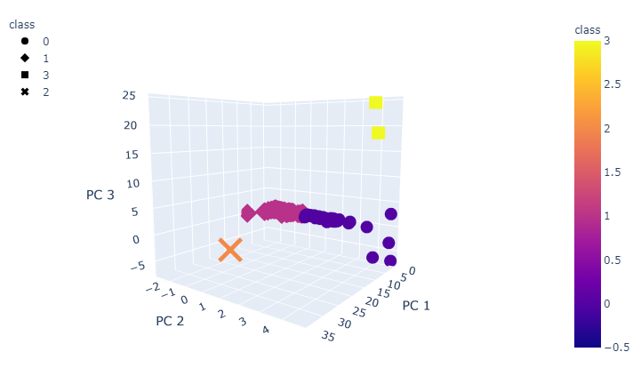
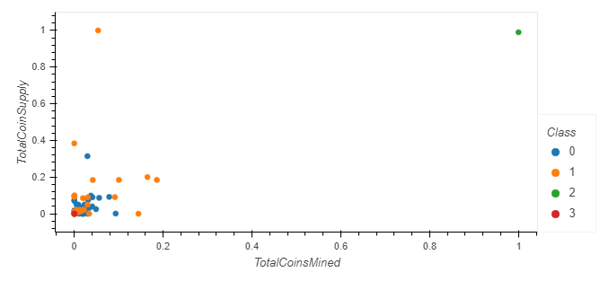

# Cryptocurrencies

## Project Overview
Accountability Accounting, a prominent investment bank, is interested in offering a new cryptocurrency investment portfolio for its customers. The company, however, is lost in the vast universe of cryptocurrencies. They want a report that includes what cryptocurrencies are on the trading market and how they could be grouped to create a classification system for this new investment. Since there is no known output for what they are looking for, they decided to use unsupervised learning. 

## Resources
Data Source: crypto_data.csv (retrieved from [CryptoCompare](https://min-api.cryptocompare.com/data/all/coinlist))
Software: Python 3.7.7, Jupyter Notebook
Dependencies: pandas, hvplot.pandas, plotly.express, sklearn.preprocessing (StandardScaler, MinMaxScaler), sklearn.decomposition (PCA), sklearn.cluster (KMeans)

## Summary
Since the data we had to work with was not ideal, we had to preprocess the dataset to fit the machine learning models. This included removing columns that were irrelevant to the machine learning training process, dropping the rows that had missing data, converting categorical variables into indicator variables, standardising the data, and reducing data dimensions using PCA. After reducing the data dimensions, the dataset was ready to be clustered using the K-means algorithm. An elbow curve was created to determine the best value for K. The dataset was ran in the K-means model and clusters were predicted. These were the visualisations of the results.

### Elbow Curve to determine the number of clusters

### 3D-Scatter Plot with Clusters

### 2D Scatter Plot with Clusters

